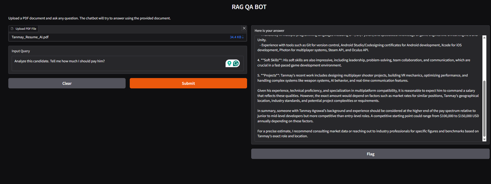

# 🤖 RAG QA Bot — Chat with your PDF locally


A privacy-first conversational AI chatbot that lets you upload any PDF and have a full conversation about it. Powered by a fully local RAG (Retrieval-Augmented Generation) pipeline — **no API keys, no internet, no data leaves your machine.**

---

## 🎬 Demo

> Upload a PDF → Choose a personality → Ask questions → Get accurate answers instantly



---

## ✨ Features

| Feature | Description |
|---------|-------------|
| 📄 **PDF Upload** | Upload any PDF document and start chatting instantly |
| 🧠 **Local LLM** | Fully local inference via Ollama — zero data sent to cloud |
| 💬 **Conversational Memory** | Bot remembers context across the entire conversation |
| 🔄 **Smart Question Condensing** | Follow-up questions resolve correctly against prior context |
| 🔍 **Force Web Search** | Manual toggle to search the web anytime |
| 🎭 **3 Personality Modes** | Switch between Formal, Friendly, and Flirtatious response styles |
| ⚡ **Retriever Caching** | Embeddings cached after first load — fast follow-up responses |
| 🖥️ **Clean Chat UI** | Gradio Blocks chat interface with full message history |
| 🔑 **No API Keys** | 100% free to run — no subscriptions, no limits |

---

## 🏗️ Architecture

```
PDF Upload
    │
    ▼
PyMuPDFLoader          ← Fast PDF parsing (PyMuPDF)
    │
    ▼
RecursiveCharacterTextSplitter   ← 500 char chunks, 50 overlap
    │
    ▼
nomic-embed-text (Ollama)        ← Local embedding model
    │
    ▼
ChromaDB                         ← Vector store (in-memory)
    │
    ├── Retriever Cache          ← Skips re-embedding on follow-ups
    │
    ▼
User Query
    │
    ├── Smart Condensing         ← Rewrites follow-up questions with context
    │
    ▼
Semantic Search → Top K Chunks Retrieved
    │
    │
    ▼
Qwen 2.5 3B (Ollama)            ← Local LLM, temperature 0.7
    │
    ├── Personality System Prompt (Formal / Friendly / Flirtatious)
    │
    ├── Manual Web Search Toggle → DuckDuckGo Search Tool
    ▼
Gradio Chat UI                   ← Response displayed with history
```

---

## 🛠️ Tech Stack

| Tool | Version | Purpose |
|------|---------|---------|
| [Ollama](https://ollama.com) | Latest | Local LLM inference |
| [Qwen 2.5 3B](https://ollama.com/library/qwen2.5) | 3B | Language model |
| [nomic-embed-text](https://ollama.com/library/nomic-embed-text) | Latest | Local embeddings |
| [LangChain](https://langchain.com) | 0.4.x | RAG pipeline orchestration |
| [ChromaDB](https://trychroma.com) | Latest | Vector database |
| [PyMuPDF](https://pymupdf.readthedocs.io) | Latest | Fast PDF loading |
| [DuckDuckGo Search](https://pypi.org/project/duckduckgo-search/) | Latest | Web search fallback |
| [Gradio](https://gradio.app) | 6.13.0 | Chat UI |

---

## 🚀 Getting Started

### Prerequisites

- Python 3.9+
- [Ollama](https://ollama.com/download) installed on your machine

### 1. Clone the repository

```bash
git clone https://github.com/GamedevDeadend/QA_Bot.git
cd QA_Bot
```

### 2. Install dependencies

```bash
pip install -r requirements.txt
```

### 3. Pull the required Ollama models

```bash
ollama pull qwen2.5:3b
ollama pull nomic-embed-text
```

### 4. Run the app

```bash
python qabot.py
```

Open your browser at `http://127.0.0.1:7860`

---

## 🎭 Personality Modes

The bot has three distinct response personalities — switch between them anytime from the UI:

| Mode | Description |
|------|-------------|
| **Formal** | Professional, precise, structured responses |
| **Friendly** | Conversational, warm, encouraging tone |
| **Flirtatious** | Playful, witty, charming — with accurate answers |

---

## 💡 How It Works

This project uses **RAG (Retrieval-Augmented Generation)** — a technique where, instead of relying purely on the LLM's training data, we:

1. **Ingest** — Load and parse the PDF using PyMuPDF
2. **Chunk** — Split into 500-character overlapping segments
3. **Embed** — Convert chunks to vectors using `nomic-embed-text` locally
4. **Store** — Index vectors in ChromaDB for fast similarity search
5. **Query** — On each question, retrieve the most relevant chunks
6. **Condense** — Rewrite follow-up questions to be self-contained (handles "what about that?" correctly)
7. **Generate** — Feed retrieved context + personality prompt to Qwen 2.5 3B
8. **Web Search** — Optionally trigger DuckDuckGo search via the UI toggle to supplement answers with live web results

The bot answers from **your document**, not from general knowledge.

---

## 📁 Project Structure

```
QA_Bot/
│
├── qabot.py            # Main application — RAG pipeline + Gradio UI
├── requirements.txt    # Pinned Python dependencies
├── LICENSE             # Apache 2.0
├── README.md           # You are here
└── assets/
    └── demo.png        # Demo screenshot
```

---

## 🔮 Future Improvements

- [ ] **FastAPI endpoint** — expose `/ask` API for external integrations
- [ ] **Multi-PDF support** — chat across multiple documents simultaneously
- [ ] **Persistent ChromaDB** — save and reload vector stores between sessions
- [ ] **Cloud LLM option** — toggle between Ollama (local) and OpenAI/Groq (cloud)
- [ ] **Streaming responses** — token-by-token output for faster perceived speed
- [ ] **Source citations** — show which PDF page each answer came from
- [ ] **Docker deployment** — containerized setup for one-command install

---

## 📄 License

This project is licensed under the [Apache License 2.0](LICENSE) — free to use, modify, and distribute.

---

## 🙋 Author

**Tanmay Agrawal** — Game Developer turned AI Engineer
- GitHub: [@GamedevDeadend](https://github.com/GamedevDeadend)
- LinkedIn: [Tanmay Agrawal](https://linkedin.com/in/tanmay-agrawal)
